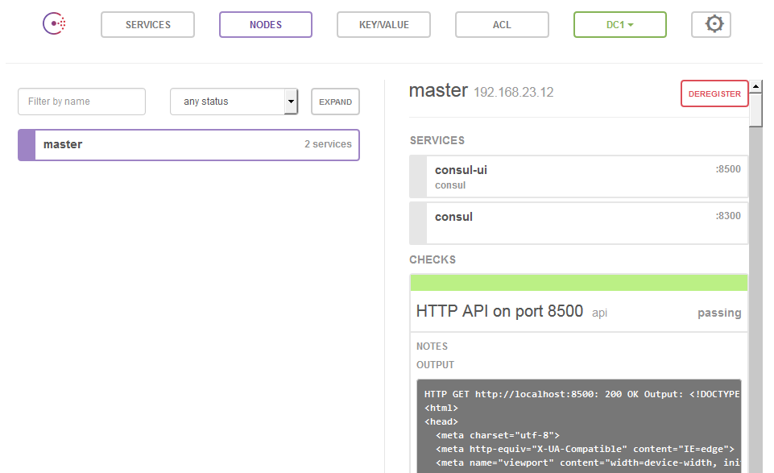

## Setup monitoring using Consul

### Basic setup of Consul

Consul will do the monitoring and service discovery in our setup.
It will know about all the web services that we have running, and monitors that they work properly.

Consul consists of servers and agents. They differ only by configuration.
In this setup there will be one server located on the salt master.
In a production setup you'll want to have a high available cluster.

Again we start with the `top.sls` configuration to register the new state. This time for all of our servers.

[source,yaml]
.salt/top.sls
----
base:
  ...
include::../../master/srv/salt/top.sls[tags=consul]
----

[source,yaml]
.salt/consul/init.sls
----
include::../../master/srv/salt/consul/init.sls[tags=consul]
----

[source,json]
.salt/consul/conf/common.json
----
include::../../master/srv/salt/consul/conf/common.json[]
----

To show how to add monitoring consul will monitor its own web console using this service plus check.

[source,json]
.salt/consul/conf/consul-ui-service.json
----
include::../../master/srv/salt/consul/conf/consul-ui-service.json[]
----

Apply this configuration to you configuration by running:

----
salt '*' state.highstate
----

Salt will show you the applied settings.
You can now look at consul's console using a web browser and the salt master's IP: http://<master>:8500/.

[[consul-ui]]

### Add monitoring for the web server

As part of our web configuration please install an additional file `httpd.json` that will contain the service plus monitoring instructions.

[source,yaml]
.salt/web/init.sls
----
include::../../master/srv/salt/web/init.sls[tags=consul]
----

And here the file:

[source,json]
.salt/web/conf/httpd.json
----
include::../../master/srv/salt/web/conf/httpd.json[]
----

As soon as you deploy this configuration using Salt, you'll see that this service appears in the Consul UI.

----
salt '*' state.highstate
----

Congratulations! You now have monitoring up and running. And Consul knows about all the hosts
that are running you web service.
